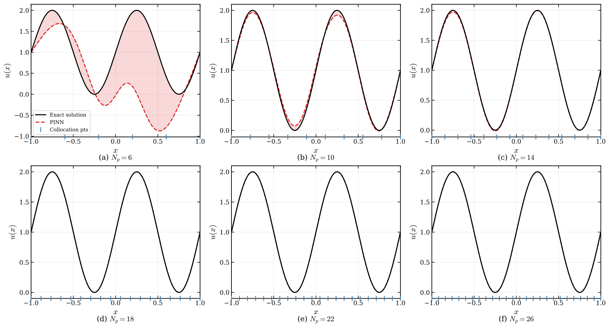

# adr-pinn

**Effective Dimensionality as an Operator Invariant for Physics-Preserving Constraint Adaptation in Physics-Informed Neural Networks**

This package implements the framework from:

> Otchere, C. & Shields, M. *Effective Dimensionality as an Operator Invariant for Physics-Preserving Constraint Adaptation in Physics-Informed Neural Networks.* arXiv:2606.06171 (2026).



---

## Overview

### $d_{\text{eff}}$: effective degrees of freedom as an operator invariant

The central result of this work is $d_{\text{eff}}$ — a scalar diagnostic computed from the Fisher Information Matrix of a trained network that measures how many parameter directions are left unconstrained by the physics operator.

The key property is **operator invariance**: for a differential operator with an analytically known kernel, $d_{\text{eff}}^{\text{pde}}$ converges to the kernel dimension regardless of network width, depth, or choice of activation function if there are enough collocation points. A second-order ODE has a two-dimensional kernel, so $d_{\text{eff}}^{\text{pde}}$ recovers 2 on any trained network, on any architecture. This makes $d_{\text{eff}}^{\text{pde}}$ a network-independent fingerprint of the operator itself, not an artifact of parameterization or training.

$d_{\text{eff}}$ is computed in three modes:

- $d_{\text{eff}}^{\text{pde}}$ — directions unconstrained by the PDE operator alone.
- $d_{\text{eff}}^{\text{bc}}$ — directions unconstrained by the boundary conditions alone.
- $d_{\text{eff}}^{\text{total}}$ — directions unconstrained by PDE and BCs jointly.

**The spatial sieve.** At sparse collocation densities, $d_{\text{eff}}^{\text{pde}}$ saturates at the grid rank — the discrete PDE loss can reach machine zero while the continuous residual and RMSE remain large: the optimization has found a degenerate point that fits the specific collocation points, but has not learned the physics operator. As grid density increases, $d_{\text{eff}}^{\text{pde}}$ drops to the analytical kernel dimension, signaling that the operator has resolved. $d_{\text{eff}}^{\text{total}}$ then collapses toward zero, signaling that both the PDE and BCs have been learned. These are concrete, architecture-independent convergence checks that the loss value alone cannot provide.

### BC adaptation via subspace projection

A trained PINN encodes a solution under specific boundary conditions. When those conditions change, the standard approach is to retrain from scratch. This package adapts the network in-place by projecting parameter updates into the null space of the PDE operator and solving for the new BCs within that subspace. An optional predictor-corrector retraction controls residual PDE drift between incremental steps.

### Key capabilities

- **$d_{\text{eff}}$ diagnostic** — operator invariant computed from the Fisher Information Matrix. Use $d_{\text{eff}}^{\text{pde}}$ to check whether the collocation grid has resolved the operator, $d_{\text{eff}}^{\text{bc}}$ to select layers for adaptation, and $d_{\text{eff}}^{\text{total}}$ to certify full constraint closure.
- **Subspace projection** — adapts BCs in-place by solving within the null space of the PDE operator, with an optional predictor-corrector retraction to control PDE drift.
- **Bring your own model** — works with any `nn.Module`. The default feedforward network is provided for convenience.

---

## Quickstart

```bash
python demo.py
```

Expected output (CPU, PyTorch 2.12, float64):

```
Demo -- device: cpu

Problem: u_xx + (2*pi)^2 * sin(2*pi*x) = 0,  ker(u_xx) = {1, x},  dim = 2

############################################################
  1. d_eff^pde after PDE-only training
############################################################

  training on 100 collocation points ...

  d_eff^pde after training  = 2.001   (analytical kernel dim = 2)
  PDE residual MSE          = 6.91e-07

############################################################
  2. d_eff^total as a well-posedness certificate
############################################################

  two BCs  u(-1), u(1)    d_eff^total = 0.038   (~0  -- certified)
  one BC   u(-1) only     d_eff^total = 1.008   (~1  -- one constraint missing)
  one BC duplicated x3    d_eff^total = 1.008   (~1  -- redundancy absorbs nothing)

############################################################
  3. Spectral hallucination on a 6-point grid
############################################################

  training on 6 collocation points ...

  discrete PDE loss (6 pts)      = 6.90e-29   (looks perfect)
  continuous PDE loss (1000 pts)  = 3.20e+02   (it is not)
  d_eff^pde                       = 6.000   (saturated at ceiling 6; kernel floor is 2)

############################################################
  4. Subspace-projection adaptation to new BCs  u(-1)=10, u(1)=2
############################################################

  adaptation time             = 0.18 s   (no retraining)
  PDE residual MSE            = 3.09e-07   (base was 6.91e-07)
  BC error                    = 1.23e-11
  RMSE vs exact sin(2pi x)-4x+6 = 5.09e-05
```

---

## Installation

```bash
git clone https://github.com/drebbel1z/adr-pinn.git
cd adr-pinn
pip install -r requirements.txt
```

**Requirements:** Python 3.10+, PyTorch 2.12, NumPy 2.0+

Tested on Python 3.14, PyTorch 2.12, NumPy 2.4 (macOS, CPU).

**Float64.** Every example calls `use_float64()` at startup. The sharper results — the integer $d_{\text{eff}}$ staircase, the sub-1e-20 residuals after L-BFGS polishing — benefit from the extra precision; float32 will still run but may give softer spectral gaps.

**CPU vs GPU.** The paper results were produced on GPU. The expected output above was produced on CPU and matches to the same integer $d_{\text{eff}}$ values and order-of-magnitude residuals — the $d_{\text{eff}}$ computation normalises the Gram matrix before pseudoinversion, which keeps the diagnostic stable across devices. L-BFGS trajectories can differ between CPU and GPU due to floating-point ordering, so exact loss values and iteration counts may vary, but the qualitative results hold on both.

---

## API

```python
import torch
import torch.nn as nn
from adr.deff import get_d_eff
from adr.adaptation import specify_bcs
from adr.training import train

# 1. Define your PDE residual and collocation/boundary points
x_pde = torch.linspace(-1, 1, 100).unsqueeze(1).requires_grad_(True)
x_bc = torch.tensor([[-1.0], [1.0]])
y_bc = torch.tensor([[0.0], [0.0]])

omega = 2 * torch.pi
def pde_residual(model, x):
    u = model(x)
    du = torch.autograd.grad(u.sum(), x, create_graph=True)[0]
    d2u = torch.autograd.grad(du.sum(), x, create_graph=True)[0]
    return d2u + omega**2 * torch.sin(omega * x)

# 2. Bring any nn.Module you like
model = nn.Sequential(
    nn.Linear(1, 100), nn.Tanh(),
    nn.Linear(100, 100), nn.Tanh(),
    nn.Linear(100, 1),
)
train(model, pde_residual, x_pde, x_bc, y_bc)

# 3. Diagnose: which layer has capacity for BC adaptation?
named_layers = [i for i, m in enumerate(model) if isinstance(m, nn.Linear)]
for i in named_layers:
    d_pde = get_d_eff(model, pde_residual, target_layers=[i], x_pde=x_pde, x_bc=x_bc, mode="pde")
    d_bc  = get_d_eff(model, pde_residual, target_layers=[i], x_pde=x_pde, x_bc=x_bc, mode="bc")
    print(f"layer {i}: d_eff^pde={d_pde:.2f}  d_eff^bc={d_bc:.2f}")

# 4. Adapt to new boundary conditions
bcs_new = [
    {"coords": [-1.0], "type": "dirichlet", "val": 0.5},
    {"coords": [1.0],  "type": "dirichlet", "val": -0.5},
]
specify_bcs(model, pde_residual, bcs_new,
            target_layers=[2], x_pde=x_pde,
            use_corrector=True)
```

---

## Repository Structure

```
adr-pinn/
├── demo.py              # Entry point: conceptual arc of the paper (~2 min on CPU)
├── requirements.txt
├── LICENSE
├── adr/
│   ├── adaptation.py    # specify_bcs, predictor, corrector
│   ├── deff.py          # d_eff computation, FIM, capacity matrices
│   ├── pinn.py          # default PINN model
│   ├── training.py      # default training loop (Adam + L-BFGS)
│   └── utils.py         # numerical utilities
└── examples/
    ├── exp_1d_adaptation.py          # 1D BC adaptation
    ├── exp_regime_anchoring.py       # Regime anchoring
    ├── exp_2d_poisson_tanh.py        # 2D Poisson, Tanh network
    ├── exp_2d_poisson_silu.py        # 2D Poisson, SiLU network 
    ├── exp_2d_poisson_comparison.py  # Subspace projection vs fine-tuning
    ├── exp_burgers_adaptation.py     # Burgers IC/BC adaptation
    ├── exp_invariance.py             # d_eff invariance across ODE orders
    ├── exp_bessel_invariance.py      # d_eff for Bessel operator
    ├── exp_nonlinear_invariance.py   # d_eff for nonlinear operators
    └── exp_spatial_sieve.py          # Spatial sieve demonstration
```


---

## Citation

```bibtex
@article{otchere2026effective,
  title={Effective Dimensionality as an Operator Invariant for Physics-Preserving Constraint Adaptation in Physics-Informed Neural Networks},
  author={Otchere, Cornelius and Shields, Michael},
  journal={arXiv preprint arXiv:2606.06171},
  year={2026}
}
```
